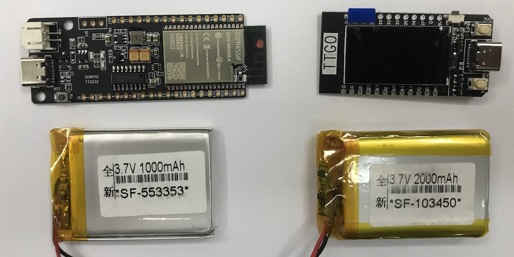

# Solarmeter

This project continuously measures the output power of a solar cell. The data is collected in Ho Chi Minh City 2020 and part of an EE (extended essay) in IB Physics at the AISVN.

## Setup

The initial setup from December 2019 requires a Laptop with Vernier software to measure just one data point. The circuit looks like this:


For the future design of April 2020 the voltage is measured by the ESP32 and the value transfered to a database in the internet every 5 minutes. This gives 288 data points per day. An article at [randomnerdtutorials](https://randomnerdtutorials.com/esp32-adc-analog-read-arduino-ide/) explains the setup and programming very well;


Additionally there are 4 digital switches for different loads planned. The ESP32 is activating them prior to the measurement and can combine the swithces for 16 different load values. The setup now looks like this:


With the 4 switches we can create 16 datapoints, that the ESP32 can read in 12 bit. Every 5 minutes we create therefore 24 byte of data. Over a day this accumulates to 6912 byte and in a year all data collected is 2.5 MByte.


## Materials


We take a ESP32 for measuring and transmitting the data over Wifi.

Power from the solar cell, backup LiPo battery with a JST-PH 2.0 connector? What is the size from Adafruit Feather? Let's see and look for the power consumption as well ...

I ordered some setup materials:

- [Solar panel 12V 3W 145x145mm](https://www.thegioiic.com/products/tam-nang-luong-mat-troi-3w-12v) enough for ESP32?
- [Solar panel 12V 1.5W 115x85mm](https://www.thegioiic.com/products/tam-nang-luong-mat-troi-1-5w-12v) I guess that's what Tom uses
- [Solar panel 5V .25W 45x45mm](https://www.thegioiic.com/products/tam-nang-luong-mat-troi-0-25w-5v) small and cheap - sufficient? Without step down converter?
- [Step down to 5V](https://www.thegioiic.com/products/mach-giam-ap-usb-ra-5v3a)
- [ESP32 with display, USB-C](https://www.lazada.vn/products/i325250821.html) 222000 VND - $ 9.40 with 1.14" display
- Battery 500 mAh for ...

## Software

``` c
/*
  ReadAnalogVoltage

  Reads an analog input on pin 0, converts it to voltage, and prints the result to the Serial Monitor.
  Graphical representation is available using Serial Plotter (Tools > Serial Plotter menu).
  Attach the center pin of a potentiometer to pin A0, and the outside pins to +5V and ground.

  This example code is in the public domain.

  http://www.arduino.cc/en/Tutorial/ReadAnalogVoltage
*/

// the setup routine runs once when you press reset:
void setup() {
  // initialize serial communication at 9600 bits per second:
  Serial.begin(9600);
}

// the loop routine runs over and over again forever:
void loop() {
  // read the input on analog pin 0:
  int sensorValue = analogRead(A0);
  // Convert the analog reading (which goes from 0 - 1023) to a voltage (0 - 5V):
  float voltage = sensorValue * (5.0 / 1023.0);
  // print out the value you read:
  Serial.println(voltage);
}
```

## Measurements and results

Data account is created, will be linked soon. Mostly to be found at [sites.google.com/ais.edu.vn/solar](https://sites.google.com/ais.edu.vn/solar).

## History

> 2019/12/03

Interview with Tom about his EE project about renewable energy in Vietnam. As for an EE (extended essay in the IB international baccalaureate) in physics an experiment should be included. And we can investigate the wind and solar power here in Nha Be on the roof of the 5th floor of the school building.

To collect data I created a new Google account as aisvn.data for emails and communication (MQTT, IFTTT). 

> 2019/12/08

The website [sites.google.com/ais.edu.vn/solar](https://sites.google.com/ais.edu.vn/solar) is created. The measured data from the last 36 hours is displayed in an interactive graph.

> 2019/12/14

I created a jupyter notebook with the first informations. The document can be found [here](https://colab.research.google.com/drive/1SWBxNhv9skyehvX9P8T1SB_Elqk8s_KK?usp=sharing). A copy is included in software.

> 2019/12/17

For about an hour during assigned study we tried to measure the characteristics of a 12 Volt 6 Watt solar panel that the school provided. The values are measured with the [Vernier voltage probe](https://www.vernier.com/product/voltage-probe/) and the [current probe](https://www.vernier.com/product/current-probe/). Unfortunately the voltage probe has a maximum voltage range of 10 Volt, while the solar panel provides up to 16 Volt without any load.

__Solution 1:__ A voltage divider made of two 1 kiloOhm resistor divided the output by 2 and moved it into the voltage limit of the probe. A successful reading now indicated the second problem: Without any load the output voltage is almost constant, since it mainly derives from the band gap in the semiconductor. This is well illustrated in this [graph from wikipedia](https://commons.wikimedia.org/wiki/File:Actual_output_in_volts,_amps,_and_wattage_from_a_100_Watt_Solar_module_in_August.jpg):

<p align="center">

</p>

Note that only the current increases during daytime. Since the power is a product of voltage and current, the power increases as well.

__Solution 2:__ A [MPPT](https://en.wikipedia.org/wiki/Maximum_power_point_tracking) (Maximum Power Point Tracking) involves a lot electronics that is well beyond the scope of IB physics. We chose to use a fixed load somewhere in the middle of the power curve. By measuring the voltage we would automatically measure the current and therefore the power.

First we had to estimate the correct resistance for the load. With the parameters of 12V and 6W one can calculate a current of I=500mA from __P=VI__ and then apply Ohm's law as __R=U/I__ which results in a resitance of R=12/0.5=24 Ohm. Another way is the direct way of __R=U²/P=12²/6=24 Ω__. Half the power would be achieved with ca. 50 Ohm and 100 Ohm creates 25% of the maximum power on the load. Since we had plenty 1 kOhm resistors we soldered 9 of them in parallel and added 2 series of two 1 kOhm resistors from the voltage divider as well. The circuid diagram looks like this:


> 2020/02/27


The hybrid wind solar power generator arrives - despite the corona virus outbreak in China. Declarations with customs and DHL took some time, but it's now here. Other parts will be ordered locally. And this controller has the __MPPT__ we mentioned in January included!

> 2020/03/18

I finally create a Github repository to document this project. The ESP32 were delivered some weeks ago. Now I got the LiPo batteries as well. Connector for the feather-style boards: __JST PH 2pin__ for reference! Purcheased at [ICDAYROI](https://icdayroi.com/) in Thủ Đức.

> 2020/03/20

The ADC of the ESP32 is not very linear. But we want to use it to measure the voltage of the solar pannel under different load situations. There might be a compensation function. The procedure and measurement was done by [Fernando Koyanagi](https://www.fernandok.com/) from Florianópolis in Brazil and published in [instructables](https://www.instructables.com/id/Professionals-Know-This/).


> 2020/04/01

The ordered TTGO ESP32 mainboard is pretty good! I ordered it mainly for the included LiPo charger, but it as 2 extra buttons (GPIO0 and GPIO 35) to the reset button. And a [1.14 Inch display](http://www.lcdwiki.com/1.14inch_IPS_Module) IPS [ST7789V](https://www.newhavendisplay.com/appnotes/datasheets/LCDs/ST7789V.pdf) with 135x240 pixel. And there are 13 GPIO pins left to use for 4 switches and one voltmeter under different load conditions.


To program the display and some voltages, example code can be found at [https://github.com/Xinyuan-LilyGO/TTGO-T-Display](https://github.com/Xinyuan-LilyGO/TTGO-T-Display)

> 2020/04/07

A second TTGO ESP32 arrived and is set to be programmed:



Without programming TTGO installed some software on the module. On the 135x240 display you get 22x30 characters with a 6x8 font. That's almost as much as my first ZX81 with 32x24. You can scan for nearby 2.4GHz networks, check the power supply and go into sleep mode. The last one is of interest for our project and the power consumption with these standard settings will be tested next.


> 2020/04/28

With an external power supply we can check the power consumption of the TTGO. The values over USB were rather high, but it has a 3.7 LiPo battery connector and the power consumption there is significantly lower, most likely because the 5V to 3.3V step-down converter is not needed. Here are the values for 3.7 Volt over battery:

- Power on, start up and screen on: 68 mA
- WiFi scan for nearby hotspots: 108 mA
- Sleep, waiting for interrupt from key pressed: 0.35 mA

With a 1000 mAh battery and the given voltage we can calculate the power consumption and projected runtime:

- Screen on: 252 mW, runtime 14 hours 42 minutes
- WiFi on: 399 mW, runtime 9 hours 15 minutes
- Hibernate: __1.3 mW__, runtime 2857 hours - or __119 days__

> 2020/05/07

School is back open since May 4th, students are back since May 5th - and now we got the solar panel and the battery! Time to find a place on the roof in Nha Be and control software to collect and transmit data.


> 2020/05/08

The wind generator arrived just one day later! Looked at location on top of the roof, 6th floor in Nha Be. Empty room for equipment is there, rain proved, and space for the 5 wired from solar and wind to the control unit. Maybe next week start first test setup?


Data: __JLS-500__ with 24V and 500 W

> 2020/05/14

The TTGO can be programmed with MicroPython and [devbis](https://github.com/devbis) created both a [slow python driver](https://github.com/devbis/st7789py_mpy/) for the display ST7789 as well as a [fast C variant](https://github.com/devbis/st7789_mpy). Further description of this module [here](https://sites.google.com/site/jmaathuis/arduino/lilygo-ttgo-t-display-esp32). And the tft driver from Loboris is working as well, details in [this instuctable from February 2020](https://www.instructables.com/id/TTGO-color-Display-With-Micropython-TTGO-T-display/). Original data at [LilyGo github](https://github.com/Xinyuan-LilyGO/TTGO-T-Display).

> 2020/05/15

We installed the 60W solar module on the roof of our school AISVN and connected MPPT controller and __24Ah__ battery. Now charging over the weekend, then connect my 60W motorcycle lamp to drain the battery every night ...


The stand for the 600W wind generator will be welded in the next week.

> 2020/05/17

First successful setup with WEMOS LoLin32 board, 2000 mAh battery and two 1kOhm voltage divider for input on pin 34. Voltage measurement every 2 minutes, upload via __IFTTT__ and webhooks to google sheet, then deep sleep. Setup:


Code:

``` C 
// Solarmeter first attempt
// Inspired by https://randomnerdtutorials.com/esp32-esp8266-publish-sensor-readings-to-google-sheets/
 
#include <WiFi.h>
#include <Wire.h>

const char* ssid     = "REPLACE_WITH_YOUR_SSID";
const char* password = "REPLACE_WITH_YOUR_PASSWORD";
const char* resource = "/trigger/solar_reading/with/key/nAZjOphL3d-ZO4N3k64-1A7gTlNSrxMJdmqy3";
const char* server = "maker.ifttt.com";

uint64_t uS_TO_S_FACTOR = 1000000;  // Conversion factor for micro seconds to seconds
uint64_t TIME_TO_SLEEP = 120;
int adcValue = 0;

void setup() {
  Serial.begin(115200); 
  delay(1000);

  initWifi();
  makeIFTTTRequest();
    
  esp_sleep_enable_timer_wakeup(TIME_TO_SLEEP * uS_TO_S_FACTOR);    
  Serial.println("Going to sleep now");
  esp_deep_sleep_start(); // start deep sleep for 120 seconds (2 minutes)
}

void loop() {
  // sleeping so wont get here 
}

// Establish a Wi-Fi connection with your router
void initWifi() {
  Serial.print("Connecting to: "); 
  Serial.print(ssid);
  WiFi.begin(ssid, password);  

  int timeout = 10 * 4; // 10 seconds
  while(WiFi.status() != WL_CONNECTED  && (timeout-- > 0)) {
    delay(250);
    Serial.print(".");
  }
  Serial.println("");

  if(WiFi.status() != WL_CONNECTED) {
     Serial.println("Failed to connect, going back to sleep");
  }

  Serial.print("WiFi connected in: "); 
  Serial.print(millis());
  Serial.print(", IP address: "); 
  Serial.println(WiFi.localIP());
}

// Make an HTTP request to the IFTTT web service
void makeIFTTTRequest() {
  Serial.print("Connecting to "); 
  Serial.print(server);
  
  WiFiClient client;
  int retries = 5;
  while(!!!client.connect(server, 80) && (retries-- > 0)) {
    Serial.print(".");
  }
  Serial.println();
  if(!!!client.connected()) {
    Serial.println("Failed to connect...");
  }
  
  Serial.print("Request resource: "); 
  Serial.println(resource);

  // raw and converted voltage reading
  adcValue = analogRead( 34 );
  String jsonObject = String("{\"value1\":\"") + adcValue + "\",\"value2\":\"" 
    + (adcValue * 2.4)   + "\",\"value3\":\"" + millis() + "\"}";
  
  client.println(String("POST ") + resource + " HTTP/1.1");
  client.println(String("Host: ") + server); 
  client.println("Connection: close\r\nContent-Type: application/json");
  client.print("Content-Length: ");
  client.println(jsonObject.length());
  client.println();
  client.println(jsonObject);
        
  int timeout = 5 * 10; // 5 seconds             
  while(!!!client.available() && (timeout-- > 0)){
    delay(100);
  }
  if(!!!client.available()) {
    Serial.println("No response...");
  }
  while(client.available()){
    Serial.write(client.read());
  }
  
  Serial.println("\nclosing connection");
  client.stop(); 
}

```

And for the first day we got this graph:


Power measurements with the WEMOS LoLin32 lite:

- On 40 mA, regardless of LED on pin 22, 148 mW
- WiFi 116 mA fluctuating (DHCP, http request), 430 mW, full cycle < 1 second (0.7 s average)
- Sleep 0.06 mA, __0.22 mW__ - runtime with 1000 mAh battery: 16666 hours, or __694 days__

Power measurements with LilyGo TTGO T-Koala with WROVER-B and USB-C

- On 35.8 mA, power LED is always on, 133 mW
- WiFi 100 mA (spikes in oscilloscope, DHCP, http request), 370 mW, full cycle < 1 second (0.7 s average)
- Sleep 0.79 mA, 2.9 mW - runtime with 1000 mAh battery: 1265 hours, or 53 days, power LED is ON 

> 2020/05/18

### Power output of 6V 2W solar panel on 39 Ohm resistor

Here is the graph: 


