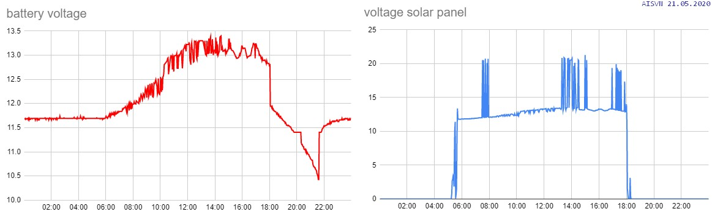

# Hybrid solar and wind generator and controller at AISVN

Recent measurements




## Software

This initial sofware is running on the ESP32:

``` c
// Solar- and windmeter at AISVN
 
#include <WiFi.h>
#include <Wire.h>

RTC_DATA_ATTR int bootCount = 0;

// Replace with your SSID and Password
const char* ssid     = "REPLACE_WITH_YOUR_SSID";
const char* password = "REPLACE_WITH_YOUR_PASSWORD";

// Replace with your unique IFTTT URL resource
const char* resource = "/trigger/value/with/key/placeyourownkeyherebitte";

// Maker Webhooks IFTTT
const char* server = "maker.ifttt.com";

// Time to sleep
uint64_t uS_TO_S_FACTOR = 1000000;  // Conversion factor for micro seconds to seconds
// sleep for 2 minutes = 120 seconds
uint64_t TIME_TO_SLEEP = 120;

int voltage[7] = {0, 0, 0, 0, 0, 0, 0};       // all voltages in millivolt
int pins[7] = {34, 35, 32, 33, 26, 22, 19};   // solar, battery, load_1, load_2, LiPo, wind, dump
int ledPin = 22;

void setup() {
  pinMode(ledPin, OUTPUT);
  digitalWrite(ledPin, LOW);  
  delay(50);
  digitalWrite(ledPin, HIGH);
  bootCount++;
  delay(1000);
  measureVoltages();

  digitalWrite(ledPin, LOW);  
  initWifi();
  makeIFTTTRequest();
  digitalWrite(ledPin, HIGH); 

  // enable timer deep sleep
  esp_sleep_enable_timer_wakeup(TIME_TO_SLEEP * uS_TO_S_FACTOR);    
  Serial.println("Going to sleep now");
  // start deep sleep for 120 seconds (2 minutes)
  esp_deep_sleep_start();
}

void loop() {
  // sleeping so wont get here 
}

// Establish a Wi-Fi connection with your router
void initWifi() {
  WiFi.begin(ssid, password);  

  int timeout = 10 * 4; // 10 seconds
  while(WiFi.status() != WL_CONNECTED  && (timeout-- > 0)) {
    delay(250);
  }
}

// Make an HTTP request to the IFTTT web service
void makeIFTTTRequest() {
  
  WiFiClient client;
  int retries = 5;

  String jsonObject = String("{\"value1\":\"") + voltage[0] + "|||" + voltage[1] + "|||" + voltage[2]
                          + "\",\"value2\":\"" + voltage[3] + "|||" + voltage[4] + "|||" + voltage[5]
                          + "\",\"value3\":\"" + voltage[6] + "|||" + bootCount + "\"}";
                      
  client.println(String("POST ") + resource + " HTTP/1.1");
  client.println(String("Host: ") + server); 
  client.println("Connection: close\r\nContent-Type: application/json");
  client.print("Content-Length: ");
  client.println(jsonObject.length());
  client.println();
  client.println(jsonObject);
        
  int timeout = 5 * 10; // 5 seconds             
  while(!!!client.available() && (timeout-- > 0)){
    delay(100);
  }
  while(client.available()){
    Serial.write(client.read());
  }
  
  client.stop(); 
}

void measureVoltages() {
  for(int i = 0; i < 7; i++) {
    voltage[i] = analogRead( pins[i] );
    voltage[i] = int( voltage[i] * 0.826 + 150 );
    if( voltage[i] == 150 ) voltage[i] = 0;
  }
}
```

## Hardware


## History

> 2020/02/27


The hybrid wind solar power generator arrives - despite the corona virus outbreak in China. Declarations with customs and DHL took some time, but it's now here. Other parts will be ordered locally. And this controller has the __MPPT__ we mentioned in January included!

> 2020/05/07

School is back open since May 4th, students are back since May 5th - and now we got the solar panel and the battery! Time to find a place on the roof in Nha Be and control software to collect and transmit data.


> 2020/05/08

The wind generator arrived just one day later! Looked at location on top of the roof, 6th floor in Nha Be. Empty room for equipment is there, rain proved, and space for the 5 wired from solar and wind to the control unit. Maybe next week start first test setup?


> 2020/05/15

We installed the 60W solar module on the roof of our school AISVN and connected MPPT controller and __24Ah__ battery. Now charging over the weekend, then connect my 60W motorcycle lamp to drain the battery every night ...

