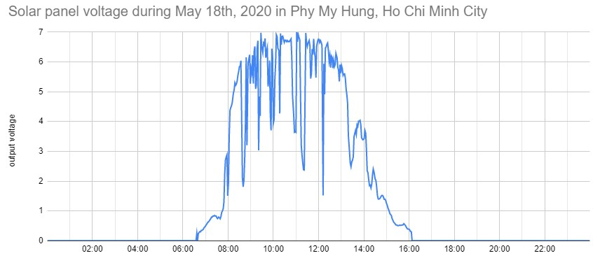

# Hybrid solar and wind generator and controller at AISVN

Recent measurements

## Software

## Hardware

## History

> 2020/02/27

The hybrid wind solar power generator arrives - despite the corona virus outbreak in China. Declarations with customs and DHL took some time, but it's now here. Other parts will be ordered locally. And this controller has the __MPPT__ we mentioned in January included!

> 2020/05/07

School is back open since May 4th, students are back since May 5th - and now we got the solar panel and the battery! Time to find a place on the roof in Nha Be and control software to collect and transmit data.

> 2020/05/08

The wind generator arrived just one day later! Looked at location on top of the roof, 6th floor in Nha Be. Empty room for equipment is there, rain proved, and space for the 5 wired from solar and wind to the control unit. Maybe next week start first test setup?

> 2020/05/15

We installed the 60W solar module on the roof of our school AISVN and connected MPPT controller and __24Ah__ battery. Now charging over the weekend, then connect my 60W motorcycle lamp to drain the battery every night ...

