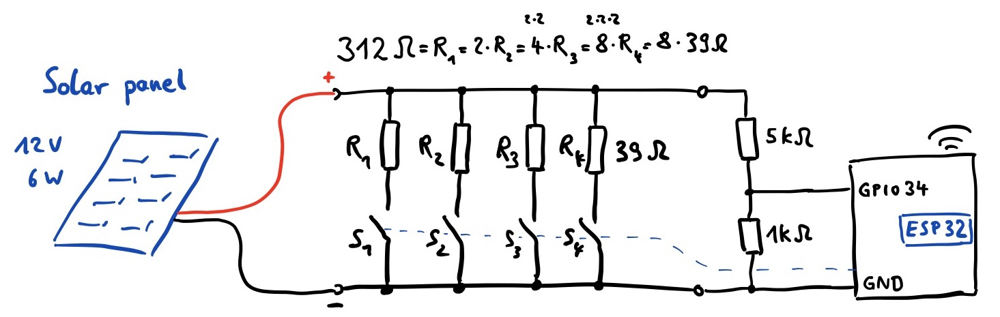
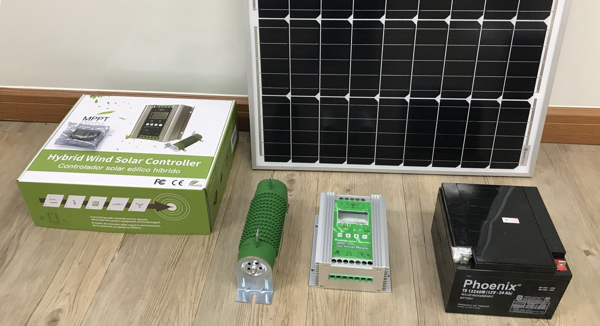
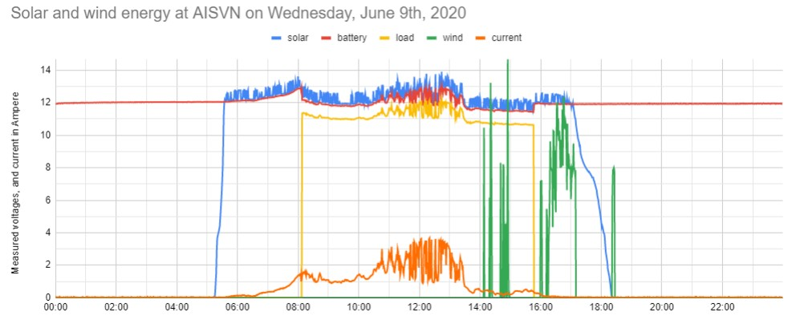
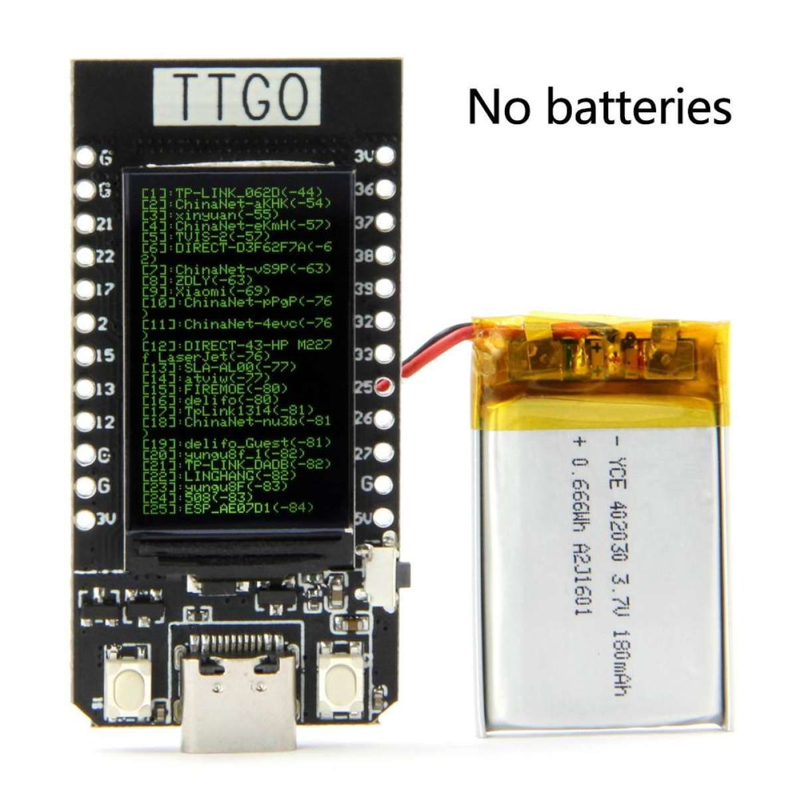
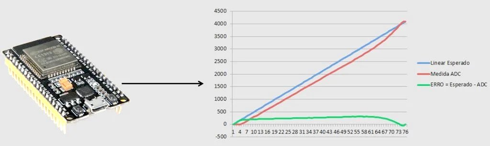
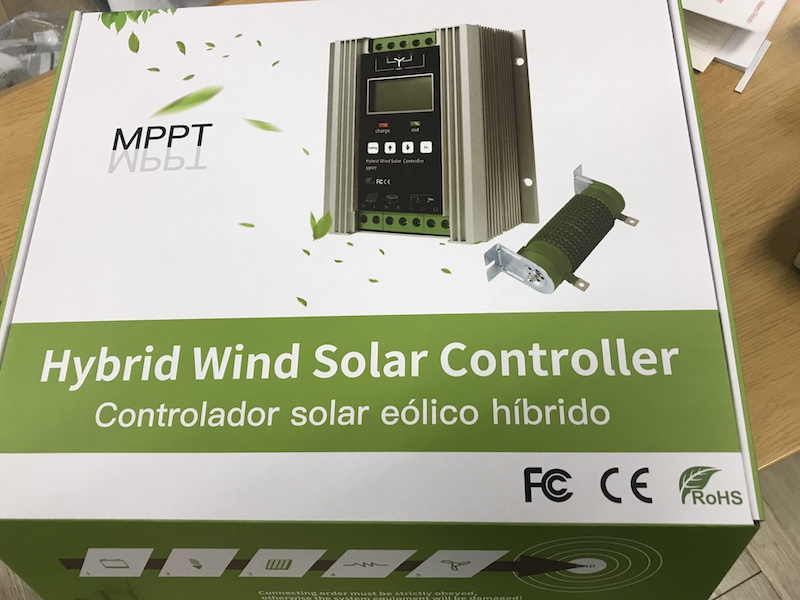

# Images and pictures

Some pictures we use to document this project

setup_2020-01-16.jpg

setup_2020-03-20.jpg

2020-05-07_solar.jpg

2020-05-08_wind.jpg wind generator just arrived - May 8th, 2020

2020-05-08_windgenerator_plate.jpeg

2020-05-15_solar.jpg

2020-05-16_setup.jpg

2020-05-21_aisvn.jpg

2020-05-21_nhabe.jpg first day with load and measurement

2020-05-25_windgenerator_stand.jpg documentation pictures May 2020

2020-06-01_powerbox.jpg measure the current of the solar panel

2020-06-02_powerbox.jpeg

2020-06-05_board.jpg setup Friday last day of school

2020-06-05_setup.jpg

20200605_circuit.png general circuit June 5th, part for wind is still missing

2020-06-06_solar.jpg solar and wind on Monday

2020-06-08_solar.jpg solar and wind on Monday

2020-06-08_wind.jpg

2020-06-09_board-bottom.jpg

2020-06-09_board-top.jpg

2020-06-09_wind-solar.jpg

2020-06-11_datacollection.png

2020-06-12_roof.jpg

2020-06-12_setup.jpg

2020-06-12_solar2.jpg

2020-06-15_multisample.png

2020-06-18_box.jpg new box with ESP32, voltage display and two shunts

2020-06-23_roof.jpg

May2020_6V_2W_panel.jpg

May2020_power.jpg

T-Koala.jpg

TTGO_ESP32.jpg

TTGO_pin.jpg

adc_esp32.jpg

analog_input_esp32.jpg

hourly_production.jpg

hybrid.jpg

p1.jpg

p2.jpg

p3.jpg

p4.jpg

ttgo.jpg

ttgo_disp1.jpg

